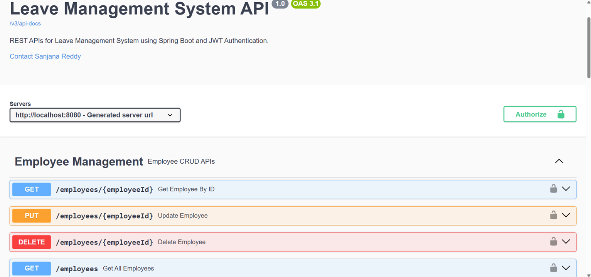
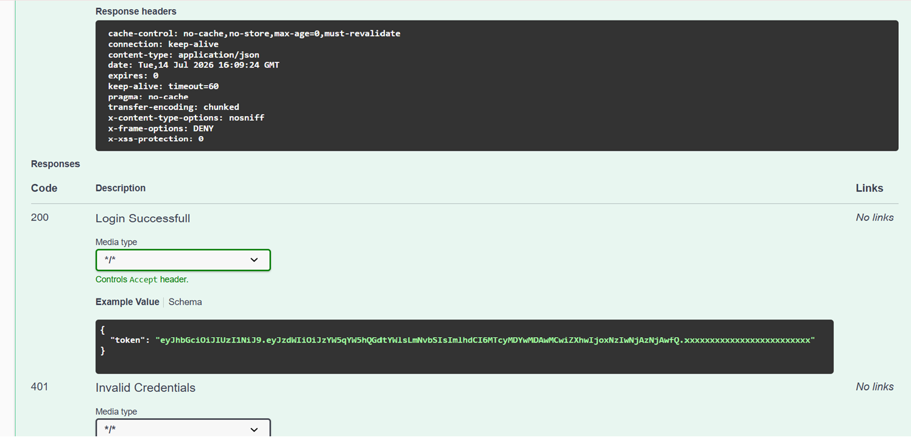
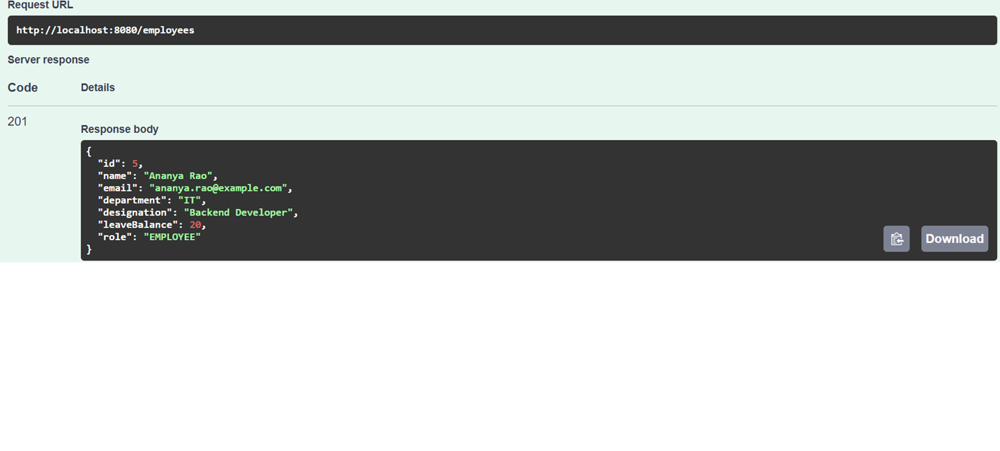
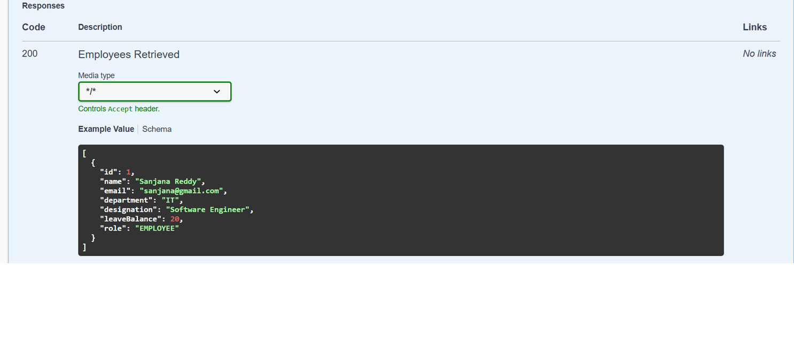
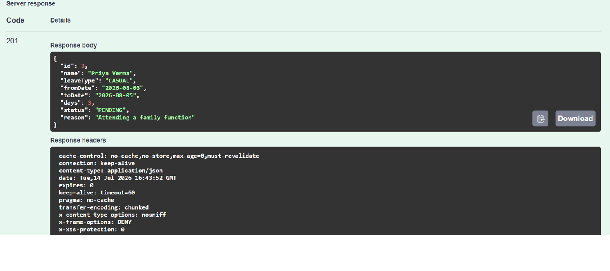
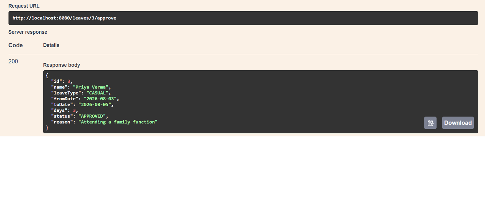
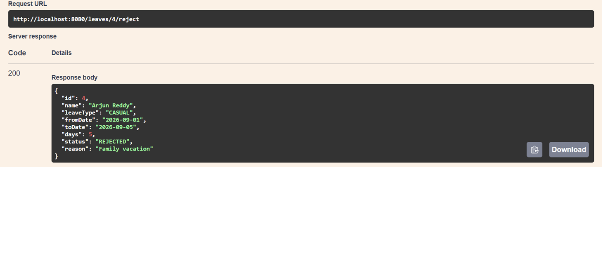
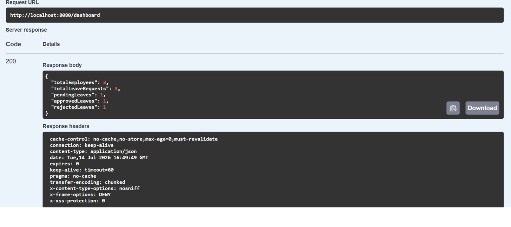
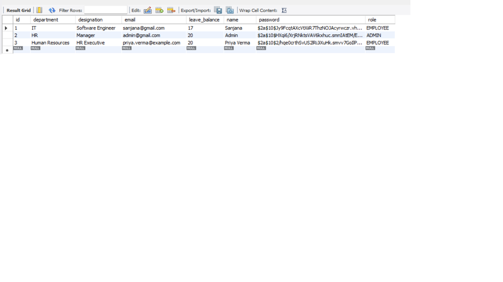

# Leave Management System

A RESTful Leave Management System built using **Spring Boot**, **Spring Security**, **JWT Authentication**, **Spring Data JPA**, and **MySQL**.

The application enables employees to apply for leave, track leave history, and manage employee information. Administrators can approve or reject leave requests, manage employees, and monitor leave statistics through a dashboard.

---
## Table of Contents

- [Features](#features)
- [Technologies Used](#technologies-used)
- [Project Architecture](#project-architecture)
- [Project Structure](#project-structure)
- [API Endpoints](#api-endpoints)
- [Authentication](#authentication)
- [Swagger Documentation](#swagger-documentation)
- [Validation](#validation)
- [Exception Handling](#exception-handling)
- [How to Run the Project](#how-to-run-the-project)
- [Future Enhancements](#future-enhancements)
- [Author](#author)
- [License](#license)


## Features

- ✅ Employee Registration
- ✅ Secure JWT Login
- ✅ Employee CRUD Operations
- ✅ Leave Application
- ✅ Leave Approval & Rejection
- ✅ Dashboard Statistics
- ✅ Search Employees
- ✅ Department Filtering
- ✅ Pagination & Sorting
- ✅ Bean Validation
- ✅ Global Exception Handling
- ✅ Swagger API Documentation


## Technologies Used

### Programming Language

- Java 17

### Backend

- Spring Boot 3
- Spring Security
- Spring Data JPA
- Hibernate

### Database

- MySQL

### Authentication

- JWT (JSON Web Token)

### Validation

- Jakarta Bean Validation

### API Documentation

- Swagger (OpenAPI)

### Build Tool

- Maven

### Development Tools

- Spring Tool Suite (STS)
- Postman
- MySQL Workbench
- Git
- GitHub

---

## Project Architecture

The application follows a layered architecture.

```text
                Client
      (Postman / Swagger UI)
                 │
                 ▼
         Controller Layer
                 │
                 ▼
          Service Layer
                 │
                 ▼
        Repository Layer
                 │
                 ▼
          MySQL Database
```

## Request Flow

```text
Client
   │
   ▼
Controller
   │
   ▼
Service
   │
   ▼
Repository
   │
   ▼
MySQL
```

### Layers

- **Controller** – Handles HTTP requests and responses.
- **Service** – Contains business logic.
- **Repository** – Performs database operations using Spring Data JPA.
- **Entity** – Represents database tables.
- **DTO** – Transfers data between client and server.
- **Mapper** – Converts Entity ↔ DTO.
- **Security** – Handles JWT Authentication and Authorization.
- **Exception** – Provides centralized exception handling.

---

## Project Structure

```text
src
└── main
    ├── java
    │   └── com.example.demo
    │       ├── config
    │       ├── controller
    │       ├── dto
    │       ├── entity
    │       ├── exception
    │       ├── mapper
    │       ├── repo
    │       ├── security
    │       └── service
    │
    └── resources
        └── application.properties
```


## Security Features

- JWT Authentication
- Stateless Session Management
- Password Encryption using BCrypt
- Protected REST APIs
- Role-Based Authorization (ADMIN / EMPLOYEE)

---

## API Endpoints

### Authentication

| Method | Endpoint | Description |
|---------|----------|-------------|
| POST | `/auth/login` | Authenticate user and generate JWT token |

---

### Employee APIs

| Method | Endpoint | Description |
|---------|----------|-------------|
| POST | `/employees` | Register a new employee |
| GET | `/employees` | Retrieve all employees |
| GET | `/employees/{employeeId}` | Retrieve employee by ID |
| GET | `/employees/me` | Retrieve logged-in employee details |
| PUT | `/employees/{employeeId}` | Update employee details |
| DELETE | `/employees/{employeeId}` | Delete an employee |
| GET | `/employees/search?name=` | Search employees by name |
| GET | `/employees/filter?department=` | Filter employees by department |
| GET | `/employees/page?page=&size=&sort=` | Pagination and sorting |

---


### Leave APIs

| Method | Endpoint | Description | Access |
|---------|----------|-------------|--------|
| POST | `/employees/{employeeId}/leaves` | Apply for leave | Protected |
| GET | `/employees/{employeeId}/leaves` | Retrieve leave history | Protected |
---

### Admin Leave APIs

| Method | Endpoint | Description | Access |
|---------|----------|-------------|--------|
| GET | `/leaves` | Retrieve all leave requests | Admin |
| GET | `/leaves/pending` | Retrieve pending leave requests | Admin |
| GET | `/leaves/approved` | Retrieve approved leave requests | Admin |
| GET | `/leaves/rejected` | Retrieve rejected leave requests | Admin |
| PUT | `/leaves/{leaveId}/approve` | Approve a leave request | Admin |
| PUT | `/leaves/{leaveId}/reject` | Reject a leave request | Admin |

---
### Dashboard API

| Method | Endpoint | Description | Access |
|---------|----------|-------------|--------|
| GET | `/dashboard` | Retrieve dashboard statistics | Admin |

---

## Authentication

The application uses **JWT (JSON Web Token)** for securing REST APIs.

### Authentication Flow

1. User logs in using email and password.
2. Spring Security authenticates the credentials.
3. JWT token is generated.
4. Client stores the token.
5. Every protected request sends the JWT token.
6. JwtAuthFilter validates the token.
7. Spring Security grants access if the token is valid.

---

## Authorization Header

```http
Authorization: Bearer <your_jwt_token>
```

---

## JWT Authentication Flow

```text
             Login Request
        (Email + Password)
               │
               ▼
      AuthenticationManager
               │
               ▼
   CustomUserDetailsService
               │
               ▼
        Employee Table
               │
               ▼
         Generate JWT
               │
               ▼
    Return Token to Client
               │
──────────────────────────────────
               │
      Protected API Request
 Authorization: Bearer Token
               │
               ▼
         JwtAuthFilter
               │
               ▼
        Validate Token
               │
               ▼
   SecurityContextHolder
               │
               ▼
          Controller
               │
               ▼
           Response
```

---

## Swagger Documentation

Swagger UI is integrated for interactive API documentation.

After starting the application, open:

```
http://localhost:8080/swagger-ui/index.html
```

OpenAPI documentation:

```
http://localhost:8080/v3/api-docs
```

---

## Validation

The application uses Jakarta Bean Validation.

Example validations include:

- Email validation
- Password validation
- Required fields
- Future date validation
- Leave reason length validation

---

## Exception Handling

Global exception handling is implemented using `@ControllerAdvice`.

Handled exceptions include:

- Employee Not Found
- Leave Not Found
- Duplicate Email
- Invalid Credentials
- Validation Errors
- Unauthorized Access

---

## How to Run the Project

### Prerequisites

- Java 17+
- Maven
- MySQL Server
- Spring Tool Suite (STS) or IntelliJ IDEA
- Postman

---

### Clone Repository

```bash
git clone https://github.com/<your-github-username>/leave-management-system.git
```

---

### Create Database

```sql
CREATE DATABASE lms;
```

---

### Configure Database

Update `application.properties`

```properties
spring.datasource.url=jdbc:mysql://localhost:3306/lms
spring.datasource.username=root
spring.datasource.password=your_password
```

---

### Run the Application

Run:

```
LmsApplication.java
```

or

```bash
mvn spring-boot:run
```

---

### Test APIs

Use:

- Swagger UI
- Postman

---

## Future Enhancements

- Docker Support
- Email Notifications
- Password Reset
- Unit Testing with JUnit
- CI/CD Pipeline
- Refresh Tokens
- Audit Logging
- Deployment to AWS

---

## Screenshots

### Swagger UI



---

### Login API



---

### Register Employee



---

### Get All Employees



---

### Apply Leave



---

### Approve Leave



---

### Reject Leave



---

### Dashboard



---

### MySQL Database



## Author

**Sanjana Reddy**

- GitHub: https://github.com/SanjanaKollu
- LinkedIn: https://www.linkedin.com/in/sanjana-kollu
---

## License

This project was developed for learning Spring Boot, Spring Security, JWT Authentication, and REST API development.

It may be freely used for educational purposes.